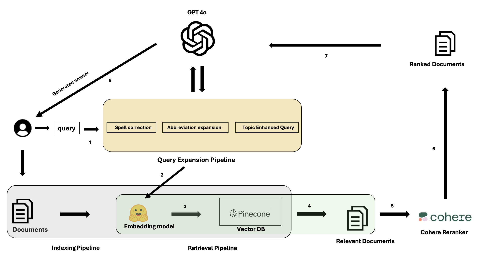

## System Architecture

The system architecture is depicted in the diagram below:

1. **User Query**: The user submits a query.
2. **Query Expansion**:
   - Corrects spelling errors.
   - Expands abbreviations.
   - Identifies the query's topic for enhancement.
3. **Indexing Pipeline**:
   - Documents are indexed using an embedding model.
   - Stored in Pinecone vector database.
4. **Retrieval Pipeline**:
   - Relevant documents are retrieved from the vector database.
5. **Cohere Reranker**:
   - The retrieved documents are ranked for relevance.
6. **Response Generation**:
   - Top-ranked documents are used to generate the final response.

### Instruction
  - To set up the system, please make a virtual conda environment : conda env -n search
  - Please install the required dependencies : pip3 install -r requirements.txt

### Instruction
To run the setup locally please cd into the src folder and follow the README.md there

### Instruction
To run the tests locally please cd into the tests folder and follow the README.md there

### NOTE
Please create .env file and paste your API keys for OpenAI, cohere to run the application. The API key for Pinecone has been aldready added to the .env.template file, which will be used to connect to the index. If you decide to use your own API key for OpenAI, please make sure you have access to GPT 4o.
